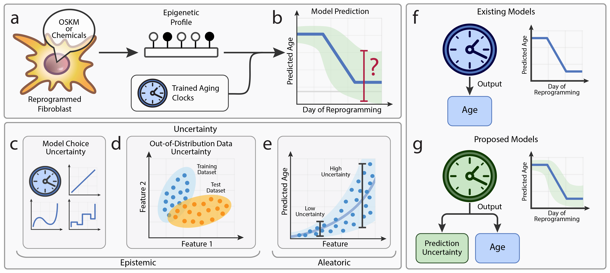

# reprogramming_ood
Investigation of out-of-distribution problem when aging clocks predict cell reprogramming or embryogenesis.


# Epistemic Uncertainty Challenges Aging Clock Reliability in Predicting Rejuvenation Effects

A repository containing the code accompanying the research paper "Epistemic Uncertainty Challenges Aging Clock Reliability in Predicting Rejuvenation Effects" by Kriukov D., Kuzmina E., Efimov E., Dylov D., and Khrameeva E.
([link to biorXiv](https://www.biorxiv.org/content/10.1101/2023.12.01.569529v1))

## Description

This repository contains code from a research paper focused on the analysis of uncertainty when epigenetic aging clocks predict rejuvenation data (reprogramming or embryonic). Our work delves into the exploration and characterization of *epistemic uncertainty* inflating when test data (e.g. reprogramming) is highly unsimilar to training data (aging). We introduce an analytical framework for consideration this problem from different points of view: covariate shift analysis, consistency between different clock models, newly developed Inverse-Train-Test procedure, and uncertainty estimation by Gaussian Process Regression (GPR) model. As the result we found that prediction of reprogramming data is coupled with high risk of prediction failure meaning that output clock predictions are quite unreliable and can not be used for validation of putative rejuvenation effects.



### Uncertainty
Importantly, we propose that future aging clocks should be capable to predict uncertainty of their predictions. 

## Installation

1. Clone the repository:
```bash
git clone https://github.com/ComputationalAgingLab/reprogramming_ood.git
```

2. Navigate to the repository directory:
```bash
cd reprogramming_ood
```

3. (optional) We recommend to reproduce the results using conda environment but you are free to install all necessary libraries manually. In case you choose conda, install it with the following command:

```bash
conda create -n ood python=3.9
```

Then activate the environment:
```bash
conda activate ood
```

4. Install the required packages within the environment:
```bash
pip install -r requirements.txt
```

## Datasets Downloading

Run script that downloads and unzip data: `bash prepare_data.sh`. Or download archive with datasets manually from [here](https://drive.google.com/file/d/11xwxb_m62FymwUeO1vC0KafZ7mog0_wq/view?usp=drive_link). You can also download datasets from GEO (See `paper/Supplementary Table 1.xlsx` for sources of separate datasets).
`dataset.zip` contains preprocessed data, as it is available at origin sources in GEO. 

### Content of Repository

The repository includes 7 jupyter notebooks named by the type of data under analysis with our analytical framework. The first three notebooks contain main results of the paper.

- `invitro_reprog_analysis.ipynb` - The main results for two in vitro reprogramming datasets. Have code used to render **Fig. 2i-k, 3d, 4e, 5c** (for Ohnuki reprogramming) and **Fig. 5d, S1a-c, S3a, S2c** (for Gill reprogramming) from the paper.

- `invivo_reprog_analysis.ipynb` - The main results for in vivo reprogramming dataset (Chondronasiou et. al., 2022). Have code used to render **3f, 5e, S1g-i, S3d** from the paper.

- `invivo_reprog_analysis.ipynb` - The main results for embryonic dataset (Auclair et. al., 2014). Have code used to render **5f, S1j-l, S3f** from the paper.

The following four notebooks contain supplementary information and pairwise testing of aging datasets.

- `aging_liver_analysis.ipynb` - The results for two murine aging liver datasets from Thompson et al., 2018 and Meer et al. 2018. Have code used to render **S1d-f, S3b, S3c** from the paper.

- `aging_skin_analysis.ipynb` - The results for two human aging skin datasets from Roos et al., 2017 and Vandiver et al. 2015. Have code used to render **2c-e, 4c-d, S4a, 2f-h** from the paper.

- `gp_1d_example.ipynb` - Containts an illustrative example of training GPR model on 1 CpG site and how it assigns high uncertainty for out-of-distribution data.

- `weight_height_analysis.ipynb` - Containts an illustrative example of how dataset shift causes systematic aging clock prediction failures. Simple and intuitive biomarkers (weight and height) were used for the demonstration.


## Citation
If you use the code or the findings from our paper, **please cite**:

Kriukov D. et al. Epistemic uncertainty challenges aging clock reliability in predicting rejuvenation effects //bioRxiv. – 2023. – С. 2023.12. 01.569529.

```
@article{kriukov2023epistemic,
  title={Epistemic uncertainty challenges aging clock reliability in predicting rejuvenation effects},
  author={Kriukov, Dmitrii and Kuzmina, Ekaterina A and Efimov, Evgeniy and Dylov, Dmitry V and Khrameeva, Ekaterina},
  journal={bioRxiv},
  pages={2023--12},
  year={2023},
  publisher={Cold Spring Harbor Laboratory}
}
```

## Contact
For any questions or clarifications, please reach out to: *dmitrii.kriukov@skoltech.ru*

## Datasets Used in Study
All datasets used in the study can be found in `paper/Supplementary table 1.xlsx`

## Acknowledgments
Special thanks to Leonid Peshkin for his valuable feedback and suggestions at the early stages of this work.


## Contributing
We welcome contributions to this repository. If you're found errors in code or experiments, please open an issue to discuss your ideas.


## License
This project is licensed under the MIT License - see the LICENSE file for details.